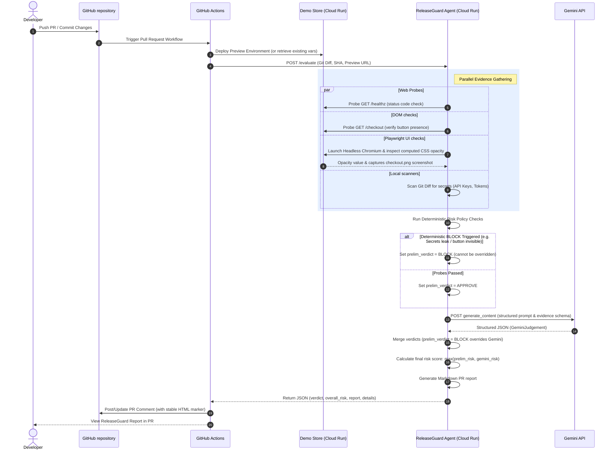

# Technical Architecture — ReleaseGuard Agent

This document explains the system design, communication protocols, and execution workflows of the ReleaseGuard Agent.

---

## Architecture Diagram

The diagram below outlines the interaction loop between the developer's pull request, GitHub Actions, the evaluated Demo Store preview, the ReleaseGuard Agent, and the Gemini API.

---

## Components

The system is deployed as a monorepo consisting of two microservices hosted on **Google Cloud Run**:

### 1. Checkout Demo Store (`apps/demo_store`)
- **Role**: Serves as the target application (SUT - System Under Test) representing the project's staging/preview environment.
- **Tech Stack**: Python, FastAPI, Jinja2 Templates, HTML/CSS.
- **Behavior**: Simulates standard user interfaces. Includes an environment variable `BUG_HIDE_CHECKOUT_BUTTON=true` which applies a CSS class `.hidden-button` (`opacity: 0`) to the payment path button, rendering it invisible to users but keeping the underlying HTML tag in the DOM.

### 2. ReleaseGuard Agent (`apps/releaseguard`)
- **Role**: The core AI release coordinator that executes probes, manages safety policies, and queries Gemini.
- **Tech Stack**: FastAPI, Playwright Async API, `google-genai` SDK, Pydantic.
- **Behavior**:
  - Exposes an endpoint `POST /evaluate`.
  - Spins up automated headless browser journeys.
  - Hosts the structured prompt compiler and deterministic rule-engine.

---

## Evidence and Verdict Logic Flow

ReleaseGuard acts as an **intelligence layer** rather than a syntax validator. Its workflow processes evidence through two distinct stages:

### Phase A: Collection
Four evidence metrics are collected asynchronously:
1. **`api_health`**: Simple endpoint HTTP status confirmation.
2. **`api_checkout`**: DOM element assertion on target button selectors.
3. **`playwright_probe`**: Dynamic headless rendering analysis (opacity, height, visibility dimensions) and screenshot persistence.
4. **`secret_scan`**: Standard regex matching on the code diff.

### Phase B: Decision Merging (Safety Guardrails)
The agent integrates deterministic rules with LLM synthesis:
- **Safety Precedence**: If rule-based policies trigger a `BLOCK` (due to exposed secrets or failed Playwright visuals), the final verdict remains `BLOCK`. Gemini cannot override a security or core checkout journey failure.
- **AI Risk Synthesis**: If rules pass (`APPROVE`), Gemini evaluates contextual variables (sensitive files modified, diff content anomalies, database refactor patterns) and can upgrade the release to `WARN`, `FIX_PR`, or `ESCALATE` (which maps to `BLOCK`).
- **Unified Score**: Overall risk is determined by:
  $$\text{Risk} = \max(\text{Policy Risk}, \text{Gemini Risk})$$
