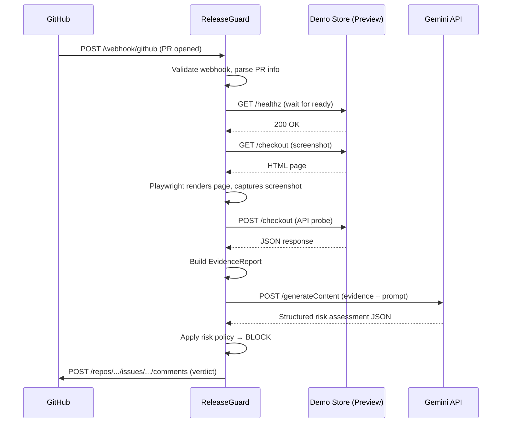

# Service Blueprint — ReleaseGuard Agent

> Architecture and service interaction map for the MVP.

## System Overview

```
┌──────────────┐     webhook      ┌──────────────────┐
│   GitHub     │ ──────────────▶  │  ReleaseGuard    │
│   (PR event) │                  │  (Cloud Run)     │
└──────────────┘                  │                  │
                                  │  1. Parse event  │
                                  │  2. Deploy preview│
                                  │  3. Collect      │
                                  │     evidence     │
                                  │  4. Ask Gemini   │
                                  │  5. Apply policy │
                                  │  6. Post comment │
                                  └───────┬──────────┘
                                          │
                          ┌───────────────┼───────────────┐
                          │               │               │
                          ▼               ▼               ▼
                   ┌────────────┐  ┌────────────┐  ┌────────────┐
                   │ Demo Store │  │ Gemini API │  │ GitHub API │
                   │ (Preview)  │  │ (Judgement) │  │ (Comment)  │
                   │ Cloud Run  │  └────────────┘  └────────────┘
                   └────────────┘
```

---

## Services

### 1. Demo Store (`apps/demo_store`)

| Property | Value |
|---|---|
| Runtime | Python 3.12 / FastAPI |
| Port | 8001 |
| Cloud Run URL | `https://demo-store-xxxxxxxxxx.a.run.app` |
| Purpose | Simulated e-commerce checkout page |

**Endpoints:**

| Method | Path | Description |
|---|---|---|
| GET | `/` | Homepage with product listing |
| GET | `/checkout` | Checkout page with form and button |
| POST | `/checkout` | Process checkout (returns JSON) |
| GET | `/healthz` | Health check |

**Demo Bug:** The PR branch modifies `/checkout` so the checkout button has `opacity: 0`. The button exists in the DOM (selector tests pass) but is invisible to users.

---

### 2. ReleaseGuard Agent (`apps/releaseguard`)

| Property | Value |
|---|---|
| Runtime | Python 3.12 / FastAPI + Playwright |
| Port | 8000 |
| Cloud Run URL | `https://releaseguard-xxxxxxxxxx.a.run.app` |
| Purpose | AI release gate agent |

**Endpoints:**

| Method | Path | Description |
|---|---|---|
| POST | `/webhook/github` | Receives GitHub PR webhooks |
| POST | `/api/evaluate` | Manual trigger for evaluation |
| GET | `/api/evaluations/{id}` | Get evaluation result |
| GET | `/healthz` | Health check |

---

## Agent Pipeline

When a PR event is received, the agent executes these steps sequentially:

### Step 1: Event Parsing

- Validate webhook signature (HMAC-SHA256).
- Extract PR number, head SHA, branch name.
- Filter: only act on `opened` and `synchronize` actions.

### Step 2: Preview Deployment (MVP shortcut)

For the MVP demo, we assume the preview is already deployed. In a production system, this would trigger a Cloud Build job.

- Construct preview URL from PR number.
- Wait for the preview to become healthy (poll `/healthz`).

### Step 3: Evidence Collection

Run probes against the preview URL:

| Probe | Method | What it checks |
|---|---|---|
| Health probe | `GET /healthz` | Service is running |
| Checkout API probe | `POST /checkout` | API returns valid response |
| Response time probe | Timing of above calls | Latency within bounds |
| Screenshot probe | Playwright screenshot | Full page capture |
| UI element probe | Playwright selectors | Critical elements exist and are visible |

Evidence is collected into a structured `EvidenceReport` Pydantic model.

### Step 4: Gemini Judgement

- Send evidence report (including base64 screenshots) to Gemini.
- Request structured JSON output matching the risk schema.
- Parse and validate response with Pydantic.

### Step 5: Risk Policy

- Apply deterministic rules from `docs/risk_policy.md`.
- Determine APPROVE or BLOCK.

### Step 6: GitHub PR Comment

- Format verdict as a Markdown comment.
- Post via GitHub API.
- Include evidence summary, risk scores, findings, and AI reasoning.

---

## Data Flow

```
GitHub PR Event
    │
    ▼
┌─────────────────┐
│ WebhookHandler   │ ── validates signature, extracts PR metadata
└────────┬────────┘
         ▼
┌─────────────────┐
│ PreviewChecker   │ ── waits for preview URL to be healthy
└────────┬────────┘
         ▼
┌─────────────────┐
│ EvidenceCollector│ ── runs API + UI probes, collects evidence
└────────┬────────┘
         ▼
┌─────────────────┐
│ GeminiJudge      │ ── sends evidence to Gemini, gets risk assessment
└────────┬────────┘
         ▼
┌─────────────────┐
│ RiskPolicy       │ ── applies deterministic rules → APPROVE | BLOCK
└────────┬────────┘
         ▼
┌─────────────────┐
│ GitHubReporter   │ ── posts formatted verdict as PR comment
└─────────────────┘
```

---

## Sequence Diagram



---

## Container Architecture

### Demo Store Container

```dockerfile
FROM python:3.12-slim
# Standard FastAPI app, ~100MB image
```

### ReleaseGuard Container

```dockerfile
FROM mcr.microsoft.com/playwright/python:v1.52.0-noble
# Includes Chromium for screenshot probes, ~600MB image
```

---

## Environment Variables

See `.env.example` for the full list. Key variables per service:

| Service | Variable | Purpose |
|---|---|---|
| Both | `GCP_PROJECT_ID` | Google Cloud project |
| ReleaseGuard | `GEMINI_API_KEY` | Gemini API access |
| ReleaseGuard | `GITHUB_TOKEN` | GitHub API access |
| ReleaseGuard | `GITHUB_WEBHOOK_SECRET` | Webhook validation |
| Demo Store | `DEMO_STORE_PORT` | Listen port |
